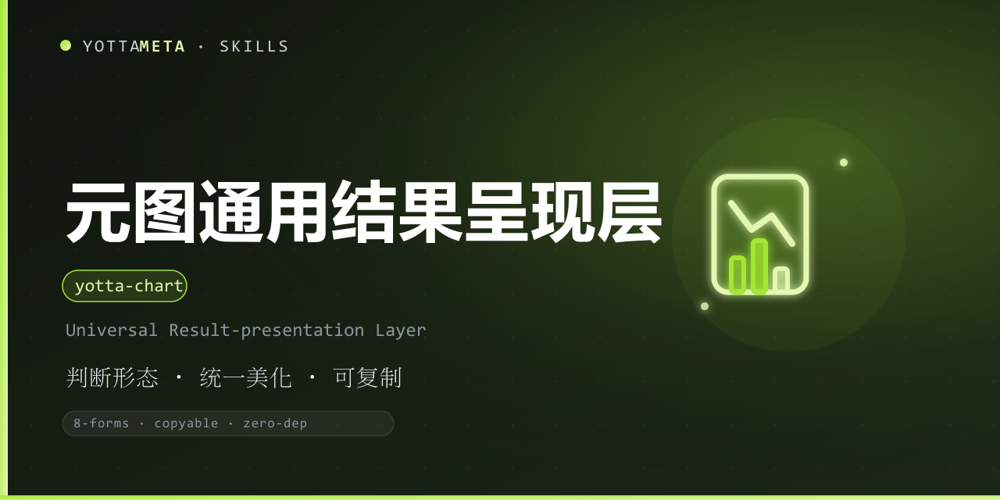

<p align="center"><b>Language</b>: English · <a href="./README.zh-CN.md">中文</a></p>

<p align="center">
  
</p>

<h1 align="center">yotta-present · YuanCheng (元呈)</h1>

<p align="center">YottaMeta's <b>universal result-presentation layer</b>: take any AI output
(conclusion / table / prose / chart / report), pick a <b>presentation form</b> via a
content-type → form judgment layer, and render it as <b>copyable</b> Markdown / plain text
(optional local SVG).</p>
<p align="center">Trigger: by default, any final result delivered to the user goes through
yotta-present (judge → pick form → render) as copyable Markdown / plain text;
explicit exceptions fall back raw — pure code / command output, error stacks / logs,
long content via <code>--out</code>, or user’s one-liner / bare text.
<b>Not a chart tool</b>; charts are only one of the presentation forms.</p>
<p align="center">Zero external dependencies (Python 3.8+ standard library); Windows + Linux + macOS;
fully local and offline — no network, no external rendering service.</p>

<p align="center">
  <a href="LICENSE"></a>
  <a href="https://agentskills.io/"></a>
  <a href="https://www.npmjs.com/package/@yottameta/yotta-present"></a>
  <a href="https://github.com/YottaMeta/yotta-present"></a>
  <a href="https://github.com/YottaMeta/yotta-present/commits/main"></a>
  <a href="https://github.com/YottaMeta/yotta-present"></a>
</p>

## Quick start (30 seconds)

```bash
# 1. Feed a standard content object -> copyable conclusion card
python3 scripts/yotta_present.py --content '{"title": "Result", "grade": "success", "verdict": "Passed", "bullets": ["point 1", "point 2"]}'

# 2. Or feed plain text and let it polish automatically
python3 scripts/yotta_present.py --file result.txt
```

From "feed content" to "copyable Markdown" in two steps. More in "Commands" and "Usage".

## What is this

AI outputs come in all shapes — raw text dumps, overused tables, bare JSON. yotta-present is a
"**presentation judgment + polish**" layer: it decides what **form** fits the content
(card / table / prose / chart / report…), applies the YottaMeta design language, and outputs
**copyable** Markdown / plain text (local SVG when useful). The user gets something that
"looks good and copies cleanly" instead of a raw dump.

It handles **presentation only** — it picks the form and renders it; it never rewrites
content or makes value judgments for the user.

## Core value

- **Unified presentation** — whatever the input (JSON / Markdown / plain text), output follows one design language (title / badge / metrics / bullets / notes).
- **Copyable-first** — Markdown (paste into any Markdown editor) + plain text (paste into Word / email).
- **AI-driven choice** — agents pick the form via the judgment layer; without an agent, `yotta_present` falls back deterministically, plus `--form` for explicit choice.
- **Local SVG** — for distributions / trends / shares, the built-in 12-chart kernel renders SVG locally; Markdown embeds a data URI (self-contained, copyable) by default; with `--svg` it writes a local SVG file and references the path.
- **Explainable** — `--explain` reports why a table / card was chosen.
- **Zero-dependency offline** — Python 3.8+ stdlib; data never leaves the machine.

## Why use it

| Advantage | Description |
|---|---|
| **Universal** | Any AI output: conclusions, comparisons, checklists, tutorials, reports, charts |
| **Copyable** | Markdown + plain text dual output; SVG is an enhancement, never a blocker |
| **Local offline** | 0 matplotlib / canvas / remote rendering; data stays on the machine |
| **Judgment layer** | Content-type → form rules live in SKILL.md (core depth); deterministic fallback works without an agent |
| **Explainable** | The reason for each form choice is available |
| **Ecosystem distribution** | GitHub + npm + ClawHub; npx / git clone / Download ZIP / install.sh |

## Standard content object schema

```json
{
  "title": "Security scan result",
  "grade": "success",
  "verdict": "No critical risk found",
  "metrics": [{"label": "Checks", "value": 8, "unit": "items"}],
  "bullets": ["All 8 checks passed"],
  "notes": ["Scan ran locally only"]
}
```

Fields: `title / headline / grade|verdict / metrics[] / rows[] / bullets[] / body[] / notes[] / chart_data? / form?`
Full reference (rows forms, chart_data, judgment rules, examples): `references/schema.md`.

## Forms (open-source baseline: 8)

| Form | CLI name | When |
|---|---|---|
| Conclusion card | `conclusion` | One conclusion / score / recommendation → badge + metrics + bullets |
| Table deliverable | `table` | Row/column data needing comparison or listing |
| Checklist card | `checklist` | Todos / key points / checklists (`[x]` / `[ ]` kept) |
| Prose | `prose` | Narrative / explanation / long paragraphs |
| Metric board | `metrics` | A set of key metrics |
| QA card | `qa` | Question / answer pairs |
| Report | `report` | Multi-section content (cards + table + prose + TOC) |
| Chart | `chart` | Distributions / trends / shares (local SVG, 12-chart kernel) |

## Commands

| Command | Description |
|---|---|
| `--content <JSON\|text>` | Pass content directly (JSON object or Markdown / plain text) |
| `--file <path>` | Read content from a UTF-8 file |
| `--form <form>` | Force a form (auto-detected by default) |
| `--template <key>` | Named scenario template: `vuln_report` / `faq` / `status` (takes precedence over `--form`) |
| `--platform <p>` | Platform adaptation: `webchat` (default) / `discord` / `whatsapp` (tables → lists, headings → bold) / `plain` (strip Markdown symbols) |
| `--channel <c>` | Render channel (default `auto`, mapped from platform): `r0` colorless baseline (no emoji) / `r1` emoji-enhanced; `r2`/`r3` reserved for later releases |
| `--max-len <n>` | Length cap (chars): compress lists → downgrade headings → truncate, keeping the conclusion |
| `--md / --text / --both / --json` | Markdown (default) / plain text / both / full JSON |
| `--out <path>` | Write to file (`--both` writes .md and .txt; a directory is named by form) |
| `--svg <path>` | Chart form: local SVG output path |
| `--explain` | Include the form-choice reason |
| `--list-forms / --list-templates / --version` | List forms / list templates / show version |

## Usage

Windows: `python`; Linux/macOS: `python3`.

```bash
# Standard content object -> copyable Markdown (default)
python3 scripts/yotta_present.py --content '{"title": "Conclusion", "grade": "success", "verdict": "Passed", "bullets": ["a", "b"]}'

# Plain text input (auto-parsed + fallback polish)
python3 scripts/yotta_present.py --file result.txt

# Plain text output (paste into Word / email)
python3 scripts/yotta_present.py --content '<same as above>' --text

# Force a form + explanation
python3 scripts/yotta_present.py --content '<same as above>' --form report --explain

# Chart form: local SVG + Markdown reference
python3 scripts/yotta_present.py --content '{"chart_data": {"chart": "pie", "labels": ["A", "B"], "data": [3, 1]}}' --svg out/pie.svg

# Full JSON (for programs) / write files
python3 scripts/yotta_present.py --content '<same as above>' --json
python3 scripts/yotta_present.py --content '<same as above>' --out result.md --both

# Platform adaptation: Discord / WhatsApp (tables → lists, headings → bold) / plain terminal
python3 scripts/yotta_present.py --content '<same as above>' --platform discord
python3 scripts/yotta_present.py --content '<same as above>' --platform plain

# Render channel (default auto: plain -> r0 no-emoji, others -> r1 emoji-enhanced); force colorless baseline
python3 scripts/yotta_present.py --content '<same as above>' --channel r0

# Named scenario template (define once, reuse everywhere): vulnerability report / FAQ / status
python3 scripts/yotta_present.py --content '{"title": "SQLi", "grade": "danger", "verdict": "High risk", "rows": [["Injection point", "POST /demo.php"]], "steps": ["Step 1"], "code": "POST /demo.php HTTP/1.1", "fixes": ["Parametrized query"]}' --template vuln_report

# Length cap (token saving): compress lists, then headings, then truncate — conclusion kept
python3 scripts/yotta_present.py --content '<same as above>' --max-len 800
```

Exit codes: **0** = success; **1** = no input / read error; **2** = content validation or render error.

## MCP usage (present_result)

The skill ships one public MCP server: `yotta-present` (zero dependency, data stays local).
No separate chart MCP is needed — the `chart` form of `present_result` (`chart_data`) reuses
the 12-chart kernel. The AI **auto-configures this MCP on first use** (writes the server entry
into `mcpServers` and records the guardrail in permanent memory) — **after obtaining your
explicit consent** for each persistent change; if you decline, it falls back to the CLI
with identical output and no functionality is lost. Tools: `present_result` (with
`form` / `template` / `platform` / `max_len` / `bold_keys` / `output` / `svg` / `explain`),
`present_forms`, `present_templates`.

```json
{
  "mcpServers": {
    "yotta-present": {
      "command": "python",
      "args": ["<absolute path>/scripts/yotta_present_mcp.py"]
    }
  }
}
```

- `present_result`: `content` (JSON / Markdown / plain text) + optional `form` / `title` / `output`(md|text|both|json) / `svg` / `explain`; `form=chart` + `chart_data` reuses the 12-chart kernel (bar / line / pie / radar / scatter / histogram / funnel / waterfall / word_cloud / sankey / spreadsheet / treemap), local SVG or data URI.
- `present_forms`: list the 8 open-source baseline forms (read-only).

## Install

Choose one of four (method 1 recommended):

**Method 1: npx one-liner (npm registry)**

```bash
npx -y @yottameta/yotta-present --agent <agent-name>    # install to the agent's default user dir (recommended)
npx -y @yottameta/yotta-present --dir <path>           # install to a custom dir
npx -y @yottameta/yotta-present --list                 # list agent -> default dir
```

**Method 2: git clone**

```bash
git clone https://github.com/YottaMeta/yotta-present.git
```

**Method 3: Download ZIP**

GitHub repo page → `Code` → `Download ZIP`, unzip into the agent's skills directory.

**Method 4: install.sh**

```bash
bash install.sh --agent <agent-name>    # install to the agent's default user dir
bash install.sh --dir <path>            # install to a custom dir
bash install.sh --list                  # list agent -> default dir
```

After install, load the skill, follow the judgment layer in SKILL.md to pick a form, and use
`yotta_present` CLI or MCP `present_result` to emit copyable results.

## Before / after

**Input** (plain text):

```text
Scanned 8 checkpoints, all passed, no high-risk issues found.
```

**Output** (auto conclusion card, copyable Markdown):

```markdown
# Scan result

> 🟢 **Passed** — No high-risk issues found

**Points**

- All 8 checkpoints passed
```

## Tips

| Tip | Command / flag |
|---|---|
| Force a form | `--form conclusion / table / checklist / prose / metrics / qa / report / chart` |
| See the decision reason | `--explain` |
| Save tokens | `--max-len 800` (compress lists, demote headings, then truncate; keep the conclusion) |
| Platform adaptation | `--platform discord / whatsapp / plain` |
| Paste into Word / email | `--text` plain output |
| Bold key fields | `bold_keys: ["title", "verdict"]` |
| Named templates | `--template vuln_report / faq / status` (definitions in references/templates.json) |

## Errors

- Exit codes: **0** success; **1** no input / read error; **2** validation or rendering error.
- On error, stderr shows the **reason + a plain-language fix suggestion**.
- FAQ and pitfalls: [references/faq.md](references/faq.md).

## FAQ (quick reference)

| Question | Answer (see references/faq.md) |
|---|---|
| No badge in output? | Use a standard content object ({title, grade, verdict, bullets}) |
| table `columns` ignored? | Use rows object keys or 2D array + headers |
| chart needs `chart_data`? | Pass chart_data (chart/labels/data) |
| `--svg` error? | Chart form only; drop --svg for default data URI |
| Wrong form? | Force --form; use --explain to see why |
| MCP not loaded? | Check mcpServers + restart session; otherwise fall back to CLI |

## Boundaries

- **Not a chart tool**: charts are only one presentation form.
- **Copyable-first**: Markdown + plain text dual output; SVG is an enhancement, never a blocker.
- **Data stays local**: no network, no external rendering service.
- **No content judgment**: presentation only — never rewrites content or makes value judgments for the user.
- **Open source**: MIT-licensed; see [NOTICE](NOTICE) for trademark and brand statements.

## License

[MIT](LICENSE). Trademark and brand statements: see [NOTICE](NOTICE).
